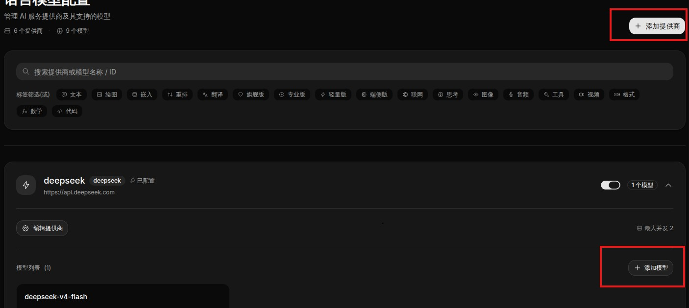
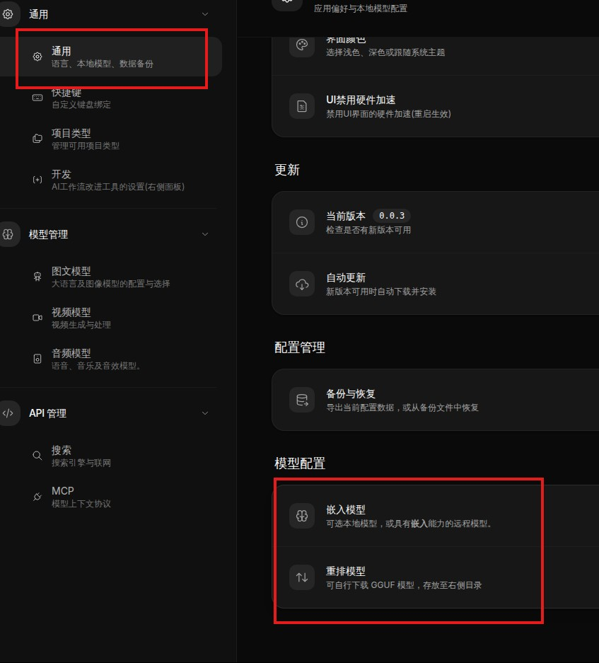
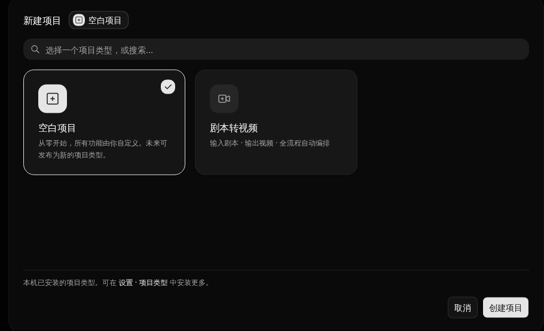
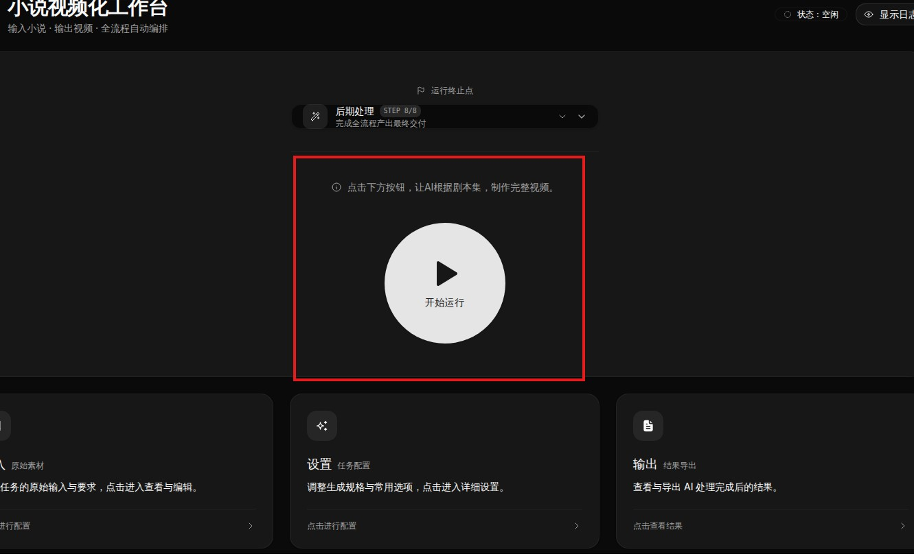

[中文](Getting-Started) | **English**
> 🌐 This is a translation. The **Chinese version is authoritative** — if anything here conflicts with the [Chinese original](Getting-Started), the Chinese version prevails, and translations may lag behind it.


# 🚀 Getting Started

This page gets you up and running in the shortest possible time. Creators can start working after finishing this page; developers should continue with the [[Workflow Development Overview|Developer-Guide.en]] afterwards.

## 1. Installation

Unigen is an Electron desktop application supporting **Windows / Linux / macOS**.

- **Recommended**: download the **portable build** for your platform from [Releases](https://github.com/masol/unigen/releases), unzip, and run.
- **Build from source**: see [[Local Setup|Local-Setup.en]].

### System Requirements: Decide Your Model Strategy First

| Strategy                                                | Local load                                    | Reference configuration                       | Best for                                             |
| ------------------------------------------------------- | --------------------------------------------- | ---------------------------------------------- | ---------------------------------------------------- |
| **External model APIs only** (built-in models disabled)  | Only SQLite + LanceDB, modest data volume     | 4-core CPU / 8 GB RAM / 2 GB disk, no GPU      | **Creators (recommended)**                            |
| **Built-in models enabled** (local embedding / reranking) | Depends on the chosen models                  | Available models depend on your hardware        | Users with hardware who want to save API costs or work offline |

When enabling built-in models, we recommend [llmfit](https://github.com/AlexsJones/llmfit) to assess what model sizes your machine can run. Note: llmfit does not directly recommend embedding/reranking models — estimate using its VRAM/RAM conversion method.

## 2. Configure Models (Once, Shared Across All Projects)

After first launch, click **Settings (bottom-left)** and configure your models:

| Model            | Required?    |
| ---------------- | ------------ |
| Text model       | **Required** |
| Embedding model  | **Required** |
| Reranking model  | Recommended  |

These settings **only need to be configured once** and apply to all project types.






## 3. Create Your First Project

Creating a project requires choosing a **project type**:

- **Script-to-Video** — the current demonstration project type, for testing and experiencing the full pipeline.
- **Blank Project** — for developers, with workflow-development capabilities built in (see [[Developer Guide|Developer-Guide.en]]).

Creators should choose "Script-to-Video" to explore. More project types will land per the [[Roadmap|Roadmap.en]]; you can also import project types published by developers. (**Note: the current version trusts code by default — template provenance verification and malicious-code protection are weak. Do not install project templates from untrusted sources.**)



## 4. Run

After opening a project, you will see a **large run icon** — click it and the workflow begins executing. You will be notified when execution finishes, and logs are available for inspection.



Long-chain workflows take a long time to run — this is normal. Unigen's foremost design goal is that **quality never collapses**; slowness is a consequence of today's limited compute.

## 5. Developers: Try the Built-In Reasoning Methods

With any project open, click the **right edge** to expand the Reflection Assistant (a project must be open), then enter:

```
/prism Give me a few short, hilarious ad concepts for facial tissues.
```

`/prism` does not persist anything, so you can directly compare **Prism against the model's direct answer**. For how it works, see [[Prism Reasoning|prism.en]] (Section 10 is a verbatim transcript of exactly this example).

```
/plan From an idea to a complete novel
```

`/plan` persists its output and takes a very long time. For the current planner, see [[Loom: Reverse Deliverable Planning on a Graph Blackboard|loom.en]]. You can then execute, improve, and publish the resulting workflow.

## 6. Next Steps

- **Creators** → [[Running Your First Workflow|Using-Workflows.en]]
- **Developers** → [[Workflow Development Overview|Developer-Guide.en]]